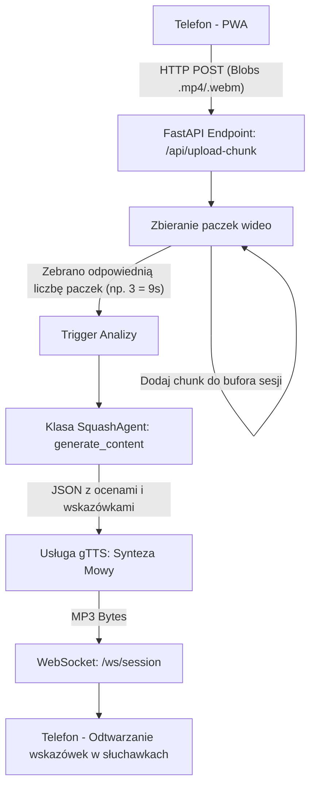

# Squash AI Coach - Backend API

Backend systemu **Squash AI Coach** zbudowany w języku Python przy użyciu frameworka **FastAPI**. Serwer na bieżąco analizuje strumień fragmentów wideo (chunki) przesyłanych ze smartfona na korcie, wykrywa moment zakończenia wymiany przy użyciu OpenCV, przesyła nagranie do multimodalnego modelu AI (z mechanizmem failover) i zwraca zawodnikom wskazówki taktyczne w postaci zsyntetyzowanej mowy (plik MP3) oraz struktury JSON.

---

## 🏗️ Architektura i Przepływ Danych



1. **Strumień wideo:** Smartfon gracza wysyła małe (3-sekundowe) paczki wideo o płynności 20-30 FPS za pomocą protokołu HTTP POST na `/api/upload-chunk?session_id=...`.
2. **Zamykanie okna wideo:** System zamyka okno wymiany wideo na podstawie sztywnego licznika paczek (np. po zebraniu określonej liczby chunków z frontendu). W ten sposób minimalizuje się opóźnienie w przygotowaniu fragmentów bez narzutu CPU wynikającego z ciągłej analizy klatek na serwerze.
3. **Optymalizacja i Konsolidacja:** Po wykryciu końca wymiany, backend pobiera z pamięci tymczasowej nagrane chunki z danej akcji i scala je w jeden zoptymalizowany plik wideo `.mp4` (skalowany w locie do rozdzielczości 640x360), minimalizując rozmiar przesyłany do chmury.
4. **Analiza AI z Failover:** Skonsolidowany plik trafia do asynchronicznego orkiestratora LLM. Agent posiada zaimplementowaną listę modeli zapasowych (failover queue). Jeżeli główny model `gemma-4-31b-it` (posiadający Unlimited TPM w AI Studio) nie odpowie lub odrzuci plik wideo, system przechodzi do kolejnych modeli:
   - `gemma-4-31b-it` (Główny)
   - `gemma-4-26b-a4b-it`
   - `gemini-3.5-flash`
   - `gemini-3-flash-preview`
   - `gemini-3.1-flash-lite`
   
   *Uwaga:* Jeżeli model nie wspiera natywnego przesyłu kontenera wideo (np. starsze wersje lub specyficzne API), agent automatycznie ekstrahuje klatki w locie (1 klatka na sekundę) i wysyła je jako tablicę obrazów JPEG w zapytaniu multimodalnym.
   Model dodatkowo przyjmuje wstrzykniętą informację o imionach graczy i ich wyglądzie, dzięki czemu unika opisywania graczy po ubiorze i zwraca się bezpośrednio do nich (np. "Jan, popraw zamach!").
5. **Synteza Mowy (gTTS):** Zwrócony przez AI ustrukturyzowany JSON jest parsowany, a wskazówki taktyczne dla obu graczy są łączone w jeden tekst i przetwarzane przez `gTTS` na plik `.mp3` bezpośrednio w pamięci RAM.
6. **WebSocket:** Gotowy plik audio `.mp3` oraz oryginalne oceny w JSON są natychmiast odsyłane do klienta przez stałe połączenie WebSocket. Połączenie to przy otwarciu może przyjmować parametr `players_config`, który instruuje AI, jak nazywać poszczególnych graczy na korcie.

---

## 🛠️ Uruchomienie lokalne

### Wymagania:
* Python 3.11 lub nowszy
* Zainstalowane narzędzie `ffmpeg` w systemie operacyjnym (wymagane do asynchronicznego sklejania chunków wideo)

### Krok 1: Instalacja zależności
Stwórz środowisko wirtualne i zainstaluj wymagane pakiety:
```bash
python -m venv .venv
.venv\Scripts\activate      # Na Windows
source .venv/bin/activate   # Na macOS/Linux
pip install -r requirements.txt
```

### Krok 2: Zmienne środowiskowe
Stwórz plik `.env` w katalogu głównym backendu i uzupełnij klucz API Gemini:
```env
GEMINI_API_KEY=twoj_klucz_api_gemini
```

### Krok 3: Uruchomienie serwera deweloperskiego
```bash
python -m uvicorn app.main:app --reload --port 8000
```
Serwer będzie dostępny pod adresem: `http://localhost:8000`. Endpointy API:
* Podgląd statusu: `GET /`
* Health Check: `GET /health`
* Upload chunków: `POST /api/upload-chunk?session_id=XYZ`
* Kanał WebSocket: `ws://localhost:8000/ws/session?session_id=XYZ&players_config={...}`

---

## 🐳 Docker

W celu uniknięcia problemów z instalacją bibliotek systemowych i programu `ffmpeg`, przygotowano gotowy plik `Dockerfile` oparty o `python:3.11-slim` z dystrybucją Debian.

### Budowanie obrazu:
```bash
docker build -t squash-backend .
```

### Uruchomienie kontenera:
```bash
docker run -d -p 7860:7860 --env GEMINI_API_KEY="twój_klucz" squash-backend
```

---

## 🚀 Wdrożenie na Hugging Face Spaces (Darmowy Hosting Docker)

Hugging Face pozwala na hostowanie kontenerów Docker za darmo (16GB RAM, 2 vCPU), a co najważniejsze – **przestrzeń nie jest usypiana przy braku aktywności**, co zapewnia natychmiastowe działanie WebSocketów podczas meczu.

1. Utwórz nowe Space na Hugging Face:
   * Wybierz typ: **Docker**
   * Wybierz szablon: **Blank**
2. W ustawieniach Space (**Settings -> Variables and secrets**) dodaj sekret:
   * Nazwa: `GEMINI_API_KEY`
   * Wartość: Twój klucz API Google Gemini
3. Zainicjalizuj i spuszuj kod z katalogu `backend/` na serwer HF:
   ```bash
   git init
   git add .
   git commit -m "Deploy to HF Spaces"
   git remote add origin https://huggingface.co/spaces/NAZWA_UZYTKOWNIKA/NAZWA_SPACE
   git push -u origin main --force
   ```
4. Adres URL Twojego działającego Space (np. `https://twoj-profil-nazwa-space.hf.space`) posłuży jako adres backendu w ustawieniach frontendu.
